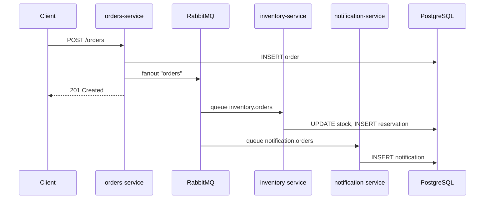
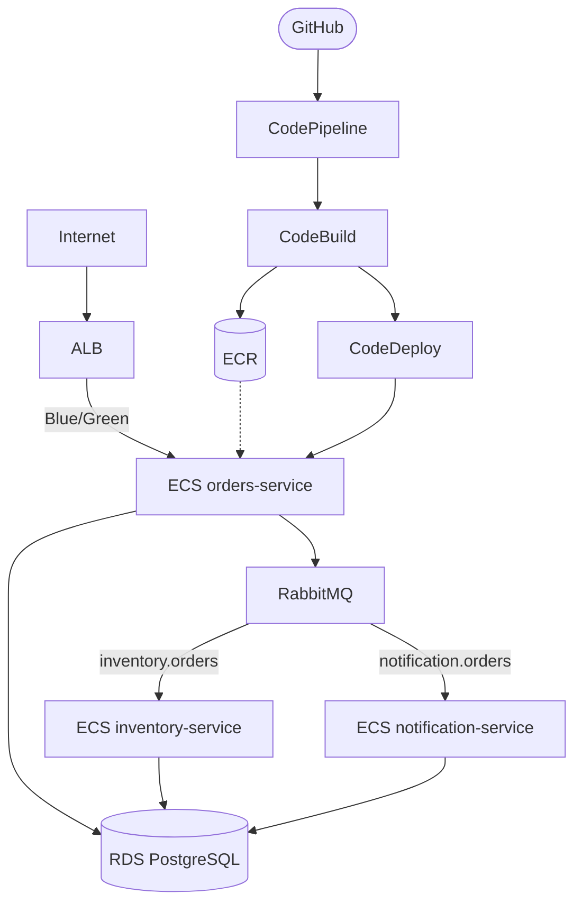

# Arquitetura — Workshop E-commerce

## Fluxo de dados



---

## Infraestrutura (AWS)



---

## Tabelas

```mermaid
erDiagram
    orders ||--o{ reservations : gera
    orders ||--o{ notifications : gera
    stock ||--o{ reservations : reserva

    orders { varchar id PK; varchar product; int quantity; varchar customer; varchar status }
    stock { varchar product PK; int quantity }
    reservations { serial id PK; varchar order_id; varchar product; int quantity; varchar status }
    notifications { varchar id PK; varchar type; varchar order_id; varchar to_email }
```
