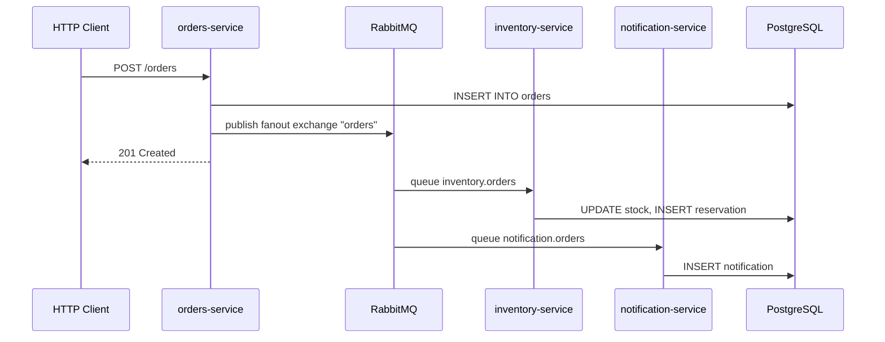
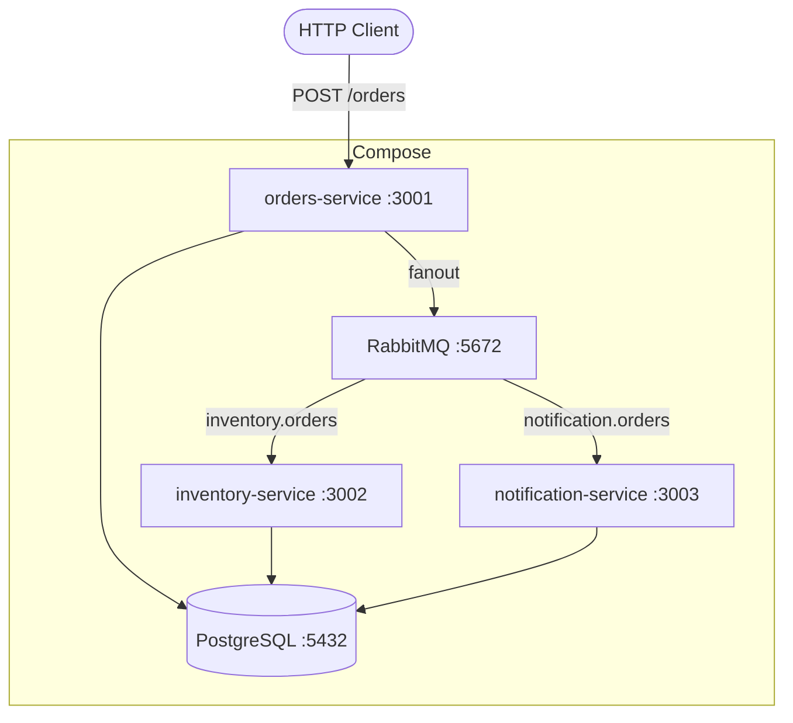
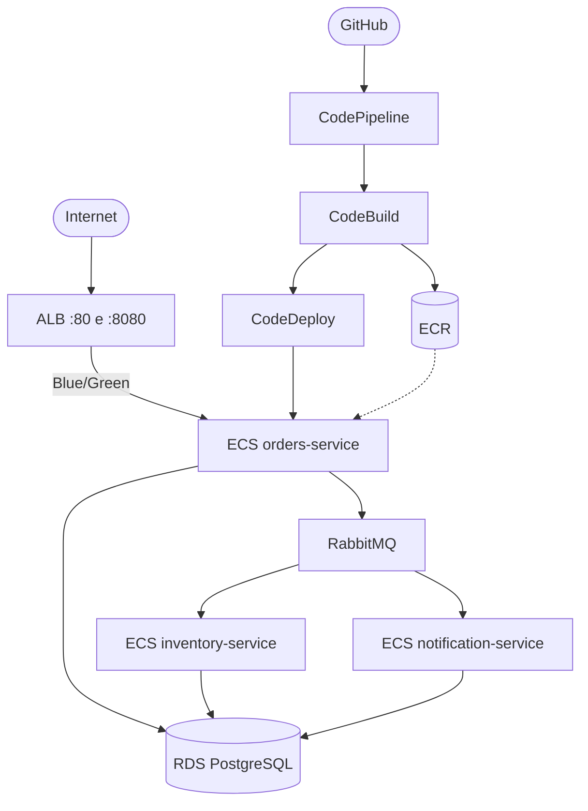
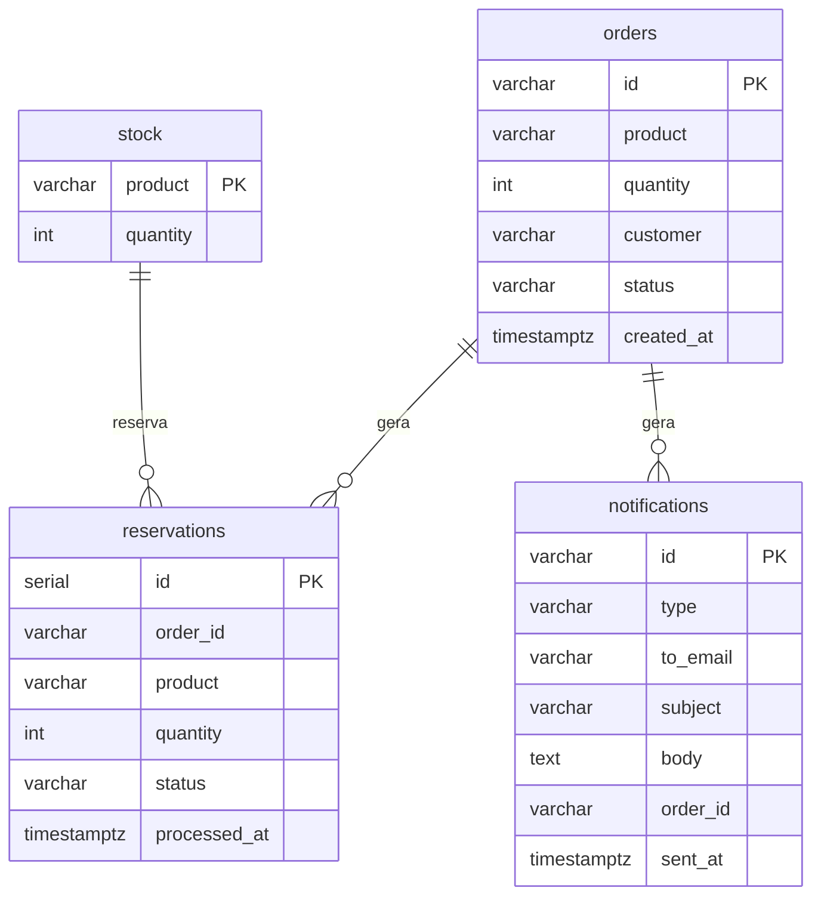

# Arquitetura — Workshop E-commerce

## Fluxo de dados

```mermaid
sequenceDiagram
    participant Client as HTTP Client
    participant OS as orders-service
    participant RMQ as RabbitMQ
    participant IS as inventory-service
    participant NS as notification-service
    participant PG as PostgreSQL

    Client->>OS: POST /orders
    OS->>PG: INSERT INTO orders
    OS->>RMQ: publish fanout exchange "orders"
    OS-->>Client: 201 Created

    RMQ->>IS: queue inventory.orders
    IS->>PG: UPDATE stock, INSERT reservation

    RMQ->>NS: queue notification.orders
    NS->>PG: INSERT notification
```

---

## Arquitetura local (docker-compose)

```mermaid
graph TD
    Client([HTTP Client]) -->|POST /orders| OS

    subgraph Compose
        OS[orders-service :3001]
        IS[inventory-service :3002]
        NS[notification-service :3003]
        RMQ[RabbitMQ :5672]
        PG[(PostgreSQL :5432)]
    end

    OS -->|fanout| RMQ
    RMQ -->|inventory.orders| IS
    RMQ -->|notification.orders| NS
    OS --> PG
    IS --> PG
    NS --> PG
```

---

## Arquitetura AWS

```mermaid
graph TD
    Internet([Internet]) --> ALB[ALB :80 e :8080]
    ALB -->|Blue/Green| OS[ECS orders-service]
    OS --> RDS[(RDS PostgreSQL)]
    OS --> MQ[RabbitMQ]
    MQ --> IS[ECS inventory-service]
    MQ --> NS[ECS notification-service]
    IS --> RDS
    NS --> RDS

    GH([GitHub]) --> CP[CodePipeline]
    CP --> CB[CodeBuild]
    CB --> ECR[(ECR)]
    CB --> CD[CodeDeploy]
    CD --> OS
    ECR -.-> OS
```

---

## Tabelas do banco

```mermaid
erDiagram
    orders {
        varchar id PK
        varchar product
        int quantity
        varchar customer
        varchar status
        timestamptz created_at
    }
    stock {
        varchar product PK
        int quantity
    }
    reservations {
        serial id PK
        varchar order_id
        varchar product
        int quantity
        varchar status
        timestamptz processed_at
    }
    notifications {
        varchar id PK
        varchar type
        varchar to_email
        varchar subject
        text body
        varchar order_id
        timestamptz sent_at
    }

    orders ||--o{ reservations : "gera"
    orders ||--o{ notifications : "gera"
    stock ||--o{ reservations : "reserva"
```
